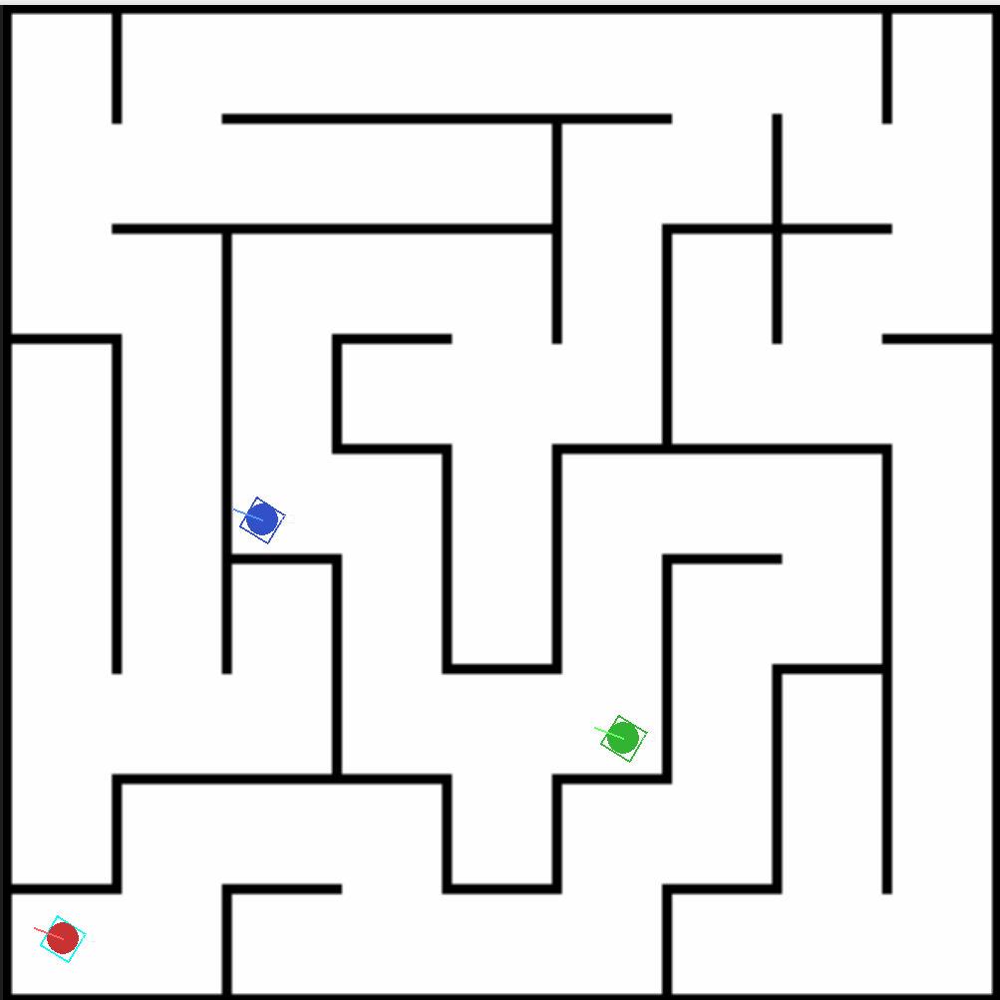
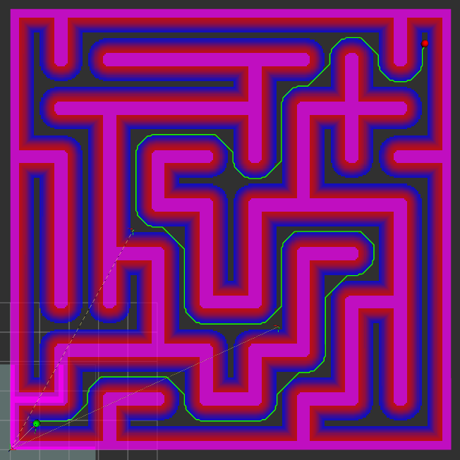

# 27算法组导航方向招新大作业

## 0\. 环境配置

```Plain Text
// 已装 Ubuntu 22.04 和 ROS2 Humble
sudo apt update
sudo apt install -y \
  python3-colcon-common-extensions \
  python3-rosdep \
  ros-humble-pluginlib \
  ros-humble-tf2-ros \
  ros-humble-tf2-geometry-msgs \
  ros-humble-nav-msgs \
  ros-humble-std-srvs \
  ros-humble-rviz2 \
  ros-humble-behaviortree-cpp-v3 \
  qtbase5-dev \
  libopencv-dev \
  libyaml-cpp-dev
  
pip3 install --user pygame numpy Pillow
```

## 1\. 作业目标

在给定的迷宫地图上，完成 **一次点击导航 **全流程：

1. 机器人从 **固定起点** 出发；

2. 选手在 RViz 中对 **指定终点** 发布一次目标；

3. 上层行为树 `click_nav.xml` 触发导航；

4. 下层行为树 `default_nav_with_fallback.xml` 调用 A\* 规划全局路径；

5. **你实现的控制器插件** 跟踪规划轨迹，使机器人准确、平滑地到达终点。

## 2\. 任务场景

### 2\.1 地图

|项目|数值|
|---|---|
|文件|`maze_map.pgm` / `maze_map.yaml`|
|分辨率|`0.05 m/pixel`|
|尺寸|`15.00 m × 15.00 m`（300×300）|
|走廊宽度|约 `1.50 m`|
|墙厚|约 `0.15 m`<br>|

<p align="center">
  
  
</p>

### 2\.2 固定起终点

||**map 系坐标 \(x, y\)**|**说明**|
|---|---|---|
|**起点**|`(0.900, 0.900)`|迷宫左下角通路中心；仿真初始位置已设为此处|
|**终点**|`(14.100, 14.100)`|迷宫右上角通路中心；评测时只允许对该点 click 一次|

- **不允许拖拽改起点、不允许中途二次改目标；**

- **不允许手动发布 ****`cmd_vel`**** 绕过控制器。**

### 2\.3 仿真器

- **不允许修改仿真器内部代码及参数；**

- **仿真里机器人撞墙便会卡住。**

## 3\. 发放内容与你需要完成的部分

### 3\.1 发放给你的代码

|包|内容|
|---|---|
|`robot_msg`|消息 / Action|
|`sp_map_server`|ESDF / 全局代价地图|
|`sp_global_planner`|A\* 全局规划|
|`sp_nav_bt`|下层 BT：`default_nav_with_fallback.xml`|
|`sp_decision`|上层 BT：`click_nav.xml`|
|`sp_nav_bringup`|启动与地图（含 `maze_map`）|
|`sp_nav_sim`|拖拽仿真（里程计 \+ TF）|
|`sp_controller_server`|控制器框架（`ControllerPlugin` 接口、`controller_node`、pluginlib 加载）|

控制器侧（名称可自定，但须 pluginlib 可加载）：

- `include/sp_controller_server/controller_plugin.hpp`（接口，只读）

- `plugins/<你的控制器>.hpp/.cpp`（由你实现）

- `plugin_description.xml`、`CMakeLists.txt`（需正确注册插件）

- `launch/controller.launch.py`

**注意：代码中已给出 PidController（\.cpp 与 \.hpp）的大体框架，可直接在此基础上修改。**

### 3\.2 你必须完成的工作（代码中已用 TODO 标明）

1. **实现路径跟踪控制器插件**

实现 `ControllerPlugin` 三个接口：

- `configure(...)`：读参数、初始化

- `setPlan(path)`：接收 `/global_path`（经 controller server 转发）

- `computeVelocityCommands(pose, velocity)`：输出 `TwistStamped`（线速度）

2. **修改参数使工程能在迷宫上跑通**

发放包中部分路径 / 话题 / 坐标系 / 为空，直接运行`sim_nav_all_start.sh`不能正确评测迷宫任务，你需要自行排查并修改。

3. **可视化与代码管理**

在 RViz 中至少清晰展示：全局代价地图、全局路径、机器人位姿、目标点等；代码要有清晰的 commit 记录，知道该忽略哪些文件。

## 4\. 评分标准（100 分）

**评测方式：固定起点 → 一次 click 到固定终点 → 记录从目标下发到判定到达的过程。**

|**分项**|**分值**|**考察内容**|
|---|---|---|
|**准确到达**|25|最终位置与终点距离|
|**时间**|25|从收到目标到到达的用时|
|**跟踪精度**|20|对采样位姿计算到全局参考路径的误差|
|**报告**|15|清晰的 README 介绍你的项目|
|**可视化与代码管理**|15|RViz 地图、路径、机器人清晰；代码管理清晰|

## 5\. 加分项（**不超过总分 100**）

- 轨迹平滑（平滑 A\* 轨迹或直接使用其他算法）；

- 自研优于 PID 的控制器（例如使用 LQR 或 MPC）。

## 6\. 提交要求

- 线上提交到自己的 git 仓库对应分支，需包含完整可编译源码；

- 如虚拟机卡顿且自己无法解决，10\.6后可线下到地下室使用小电脑调试（需提前告知群里导航方向管理员）；

- DDL：10\.25。

## 7\. 我的实现

本分支完成了作业留空的话题、坐标系、插件和控制参数，并实现了可单元测试的平面路径跟踪器。控制链为：

```text
/goal_pose -> 行为树 -> A* /global_path -> PidController
           -> map 系限速 PID/前馈 -> base_link 系 /sentry/cmd_vel
           -> 仿真器 /Odometry + TF -> 下一控制周期
```

关键行为：

- 单调最近路径点，抑制位姿噪声导致的路径回退；
- 折线累计弧长前视，遇到尖角时把目标截止在角点，避免穿墙切角；
- 位置误差 PID 与速度前馈，积分限幅、速度矢量限幅和加速度限幅；
- 拐角和终点减速，空路径、非有限输入和已到达目标时输出零速度；
- 将 `map` 系指令根据当前 yaw 旋转到仿真器要求的 `base_link` 系。

详细算法和参数见 [`docs/navigation-controller.md`](docs/navigation-controller.md)。

## 8\. Ubuntu 22\.04 / ROS2 Humble 环境

本仓库提供容器化 Ubuntu 22.04 + ROS2 Humble 环境，不会改动宿主系统版本。

```bash
docker build -f docker/Dockerfile.humble -t sp-nav-humble:2026-10-01 .
bash/nav_dev_container.sh build -- colcon build --symlink-install
```

运行单元测试和插件加载测试：

```bash
bash/nav_dev_container.sh build -- bash -lc '
  source install/setup.bash
  colcon test --event-handlers console_direct+
  colcon test-result --verbose'
```

## 9\. 一键自动评测

```bash
bash/nav_dev_container.sh build -- \
  bash/run_nav_evaluation.sh --timeout 190
```

评测器会先验证起点和 ROS 节点就绪，再且仅发布一次 `(14.1, 14.1)` 目标。它记录时间、终点误差、横向跟踪误差、指令速度和“有指令但近乎不移动”的碰墙代理指标，结果写入已忽略的 `artifacts/`。

本机默认只在评测启动参数中把局部代价地图发布率设为 `10 Hz`。原因是发放的 Python 仿真节点将代价地图和里程计定时器放在同一个互斥回调组；在本机默认 `30 Hz` 下，里程计会饥饿。`sp_nav_sim` 源码与 `sim_robot.yaml` 保持原样，JSON 也显式记录该本机兼容值；这不应被冒充为默认 30 Hz 条件的证据。

### 本机容器自动验收

|Run|到达时间|终点误差|平均横向误差|最大横向误差|最长近乎停滞|
|---|---:|---:|---:|---:|---:|
|1|141.115 s|0.212 m|0.038 m|0.318 m|0.140 s|
|2|140.226 s|0.228 m|0.033 m|0.421 m|0.183 s|
|3|122.956 s|0.227 m|0.031 m|0.170 m|0.139 s|
|4 (final)|130.000 s|0.226 m|0.056 m|0.191 m|0.130 s|

四次均满足：目标只发布一次、最终误差小于 `0.3 m`、未超时、无非有限指令、无持续 1.5 s 碰墙代理事件。

## 10\. 可选图形界面运行

本次自动验收全程为无头模式，不依赖也不启动 RViz2。若之后需要现场目视复核，可在主机允许当前用户访问 X11 后，用一个容器同时运行 RViz2 和仿真器：

```bash
xhost +SI:localuser:"$(id -un)"
bash/nav_dev_container.sh gui -- bash/run_nav_gui.sh
```

在 RViz 中选择 `2D Goal Pose`，对 `(14.1, 14.1)` 发布且只发布一次。配置已开启全局代价地图 `/global_costmap`、全局路径 `/global_path`、TF 机器人位姿和目标工具 `/goal_pose`。关闭任一窗口或在启动终端按 `Ctrl+C` 会清理全部子进程。

## 11\. 安全与已知限制

- 控制器不会发布手动 `cmd_vel`；只有 `ControllerPlugin` 通过 controller server 输出速度。
- 空路径、已到达或非有限输入均返回零速度。
- 仿真器没有发布权威碰撞话题；自动“碰墙”判定只是有指令但持续不移动的代理。最终墙面接触仍应以 RViz/仿真 GUI 目视验收为准。
- `artifacts/`、`build/`、`install/` 和 `log/` 都不进入 Git 历史。
